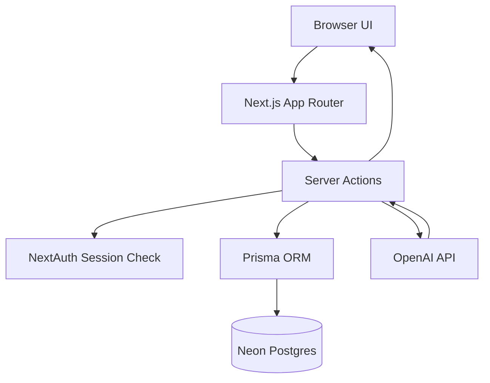

# Movie Memory - Scowtt Full-Stack Take Home

Movie Memory is a server-first web app where users sign in with Google, save a favorite movie, and generate short trivia facts about that movie.
The project focuses on backend correctness, safe external API usage, and data-model decisions that can scale as usage grows.

## Tech Stack

- Next.js (App Router) + TypeScript
- NextAuth.js + Prisma Adapter
- Prisma ORM
- Neon Postgres
- Vitest + ESLint

## Setup Instructions

### 1) Install dependencies

```bash
npm install
```

### 2) Configure environment variables

Copy `.env.example` to `.env` and provide real values:

```bash
cp .env.example .env
```

On Windows PowerShell:

```powershell
Copy-Item .env.example .env
```

### 3) Generate Prisma client

```bash
npx prisma generate
```

### 4) Run database migrations

For local development:

```bash
npx prisma migrate dev
```

For production/staging deployment:

```bash
npx prisma migrate deploy
```

### 5) Run the app

```bash
npm run dev
```

Open `http://localhost:3000`.

### 6) Run quality checks

```bash
npm run lint
npm test
```

## Required Environment Variables

The app expects the following variables:

- `DATABASE_URL`: Neon/Postgres connection string
- `NEXTAUTH_URL`: app base URL (e.g. `http://localhost:3000`)
- `NEXTAUTH_SECRET`: secret used by NextAuth session/JWT encryption
- `GOOGLE_CLIENT_ID`: Google OAuth client ID
- `GOOGLE_CLIENT_SECRET`: Google OAuth client secret
- `OPENAI_API_KEY`: server-side key for OpenAI requests
- `OPENAI_MODEL` (optional): defaults to `gpt-4o-mini`

## Database Migration Steps

This codebase uses Prisma migrations under `prisma/migrations`.

Typical workflow:

1. Update Prisma schema in `prisma/schema.prisma`
2. Create migration:
   ```bash
   npx prisma migrate dev --name your_migration_name
   ```
3. Regenerate Prisma client:
   ```bash
   npx prisma generate
   ```
4. Commit both schema and migration files
5. In production, apply existing migrations:
   ```bash
   npx prisma migrate deploy
   ```

## Architecture Overview

This project is intentionally server-first: sensitive logic and external API access stay on the server using Server Components and Server Actions.

### High-level flow



### Design choices and why

- **Server Actions for mutation logic**
  - All write paths (`completeOnboarding`, `generateMovieFact`) are server-side.
  - Why: keeps secrets and database logic off the browser, reduces client complexity, and gives one trusted place for validation + authorization + persistence.
- **Prisma + relational modeling**
  - `Movie.userId` is unique to enforce one favorite movie per user.
  - Why: invariant is guaranteed by schema, not just UI assumptions.
- **DB-backed concurrency primitives**
  - `MovieFactGenerationState` acts as a per-user/movie "generation in progress" flag.
  - Why: deterministic behavior across tabs/requests without adding Redis for this scope.
- **Graceful degraded behavior**
  - OpenAI timeout + normalized output + fallback to most recent cached fact on provider failure.
  - Why: stable UX even when external dependency is slow/unavailable.

### End-to-end generation flow (cache + generation-in-progress flag)

When user clicks **Generate a Movie Fact**:

1. Validate session and get signed-in user id.
2. Load favorite movie title; if missing, return onboarding error.
3. Check latest `MovieFact`:
   - if younger than 60 seconds, return cached fact immediately.
4. Enter generation-decision phase:
   - re-check latest fact (protects against races),
   - check `MovieFactGenerationState` for active in-flight generation,
   - attempt to claim a flag row for this `(userId, movieTitle)` pair,
   - if claim fails and flag is stale, recover it by updating `expiresAt`.
5. Decision branches:
   - `cached`: return newest fact,
   - `in_progress`: return latest known fact if available, otherwise ask user to retry shortly,
   - `generate`: call OpenAI, persist new `MovieFact`, clear flag.
6. If OpenAI fails:
   - clear flag,
   - return most recent cached fact if available, else friendly error.

### Why this is production-grade

- Correctness first: schema constraints + explicit flag-claim decisioning.
- Cost control: cache hits and flag-based deduplication reduce duplicate LLM calls.
- Resilience: timeout + fallback behavior avoids hard failures for users.
- Security posture: server-only secret usage and no client-side OpenAI keys.

### Authentication and User Lifecycle

- NextAuth + Prisma Adapter manages persistent users/sessions in relational tables.
- OAuth provider is Google.
- On first sign-in, users are routed through onboarding to set favorite movie.
- `User.hasCompletedOnboarding` tracks lifecycle transition from new user to active user.

This keeps routing and UX consistent while preserving clear backend state.

### Data Modeling Decisions

Core tables:

- `User`: identity + onboarding state
- `Movie`: one favorite movie per user (`userId` is unique)
- `MovieFact`: generated facts with timestamps for cache history
- `MovieFactGenerationState`: per-user/movie "in-progress" flag to avoid concurrent duplicate OpenAI calls

Design intent:

- enforce one movie preference per user
- keep generated facts auditable over time
- protect API cost by avoiding duplicate generation bursts
- keep concurrency logic visible at the data layer

### OpenAI Integration: Safety and Resilience

Generation logic runs in server actions only:

- reads `OPENAI_API_KEY` only on server
- applies `AbortController` timeout (30 seconds)
- normalizes and truncates model output for safe UI rendering
- returns generic user-facing errors (does not expose provider internals)

Fallback behavior:

- within cache window, returns cached fact
- if generation is already in progress, returns latest known fact or a friendly retry message
- if OpenAI fails, returns most recent cached fact if available, otherwise user-friendly error

### Caching, Concurrency, and Backend Correctness

- Cache window: 60 seconds (`FACT_CACHE_WINDOW_MS`)
- Flag TTL: 60 seconds to prevent duplicate generation calls during active request window

Implementation details:

- Cache freshness is strict (`createdAt` must be `< 60s` old).
- Flag key is `(userId, movieTitle)` so concurrent tabs for same user/movie do not fan out OpenAI requests.
- In-progress path returns the latest known fact if present, otherwise a friendly retry response.

This provides deterministic backend behavior without introducing additional infrastructure for take-home scope.

### Testing Strategy

- Unit tests are co-located with feature logic:
  - `src/app/dashboard/movie-fact-cache.test.ts`
- Current tests verify:
  - cache freshness boundaries
  - authorization helper behavior

As the app grows, next test targets are deeper flag/fallback integration paths in generation action logic.


## Which Variant and Why (A vs B)


- **Variant A — Backend-focused (Caching & Correctness)**  
  Emphasis on a 60-second cache window, concurrency controls, OpenAI failure handling, and minimal backend tests.
- **Variant B — Frontend/API-focused (Client Orchestration)**  
  Emphasis on typed HTTP APIs, client-side caching, optimistic UI for editing movies, and frontend/API tests.

This implementation deliberately chooses **Variant A**.

### Why Variant A

- **Deeper correctness at the core of the system**
  - Cache window, concurrency rules, and failure handling live directly next to the database and OpenAI calls.
  - This variant allows the server to validate data, enforce invariants, and make decisions using the latest persisted state.
- **Stronger guarantees on data and authorization**
  - Authorization and actor/target checks happen in server actions, not in the browser.
  - The “one favorite movie per user” rule is enforced at the schema level (`userId` unique) and respected in onboarding logic.
- **Immediate performance and cost benefits**
  - A strict 60-second cache window means most repeated clicks reuse an existing fact instead of hitting OpenAI again.
  - The DB-backed in-progress flag (`MovieFactGenerationState`) collapses duplicate requests from multiple tabs into a single generation.
- **Why I think this is a better fit for Scowtt**
  - For a startup, keeping the core logic correct, predictable, and cost effective is more urgent than a fully generic HTTP API layer.

### What Variant B would add

- **Reusable, typed HTTP APIs**
  - Endpoints like `GET /api/me`, `PUT /api/me/movie`, and `GET /api/fact` with a typed client layer would make it easier to reuse the backend.
- **Richer client-side UX**
  - Inline movie editing with optimistic UI and client-side caching would make the dashboard feel more interactive.
  - A typed client wrapper would centralize error handling and enable more focused frontend/API tests.

These are valuable, but they are primarily **platform and DX improvements** that shine more as the product grows and accumulates more clients and flows.

### Conclusion

Variant A’s benefits—correctness, data modeling, concurrency behavior, and OpenAI safety—have **immediate impact on the core engine** and align directly with the rubric (cache window correctness, concurrency reasoning, backend correctness).  
Variant B would be a natural **next layer** on top of this foundation, and in a longer timeframe both would be implemented, but within this timebox Variant A takes precedence.

## Key Tradeoffs Made

- Chose a DB-backed in-progress flag table instead of Redis due to time constraints.
- Kept generation in request/response path (not background jobs) for faster implementation and simpler UX.
- Stored `movieTitle` alongside facts for straightforward querying in current design, at the cost of tighter normalization.
- Focused tests on core cache/auth helpers first; full concurrency integration testing deferred.
- Preferred explicit, readable server logic over introducing abstraction layers too early.

## Limitations

- The burst/idempotency approach uses a DB-backed "generation in progress" flag without wrapping every decision in a single DB transaction.
- Under extreme contention, flag claim/recovery is best-effort and relies on unique-key conflict handling plus TTL semantics.
- Flag TTL is static (60 seconds). If upstream latency patterns change significantly, TTL tuning may be needed.
- This is app-level concurrency protection for one generation flow, not a full distributed job-queue architecture.

## What I Would Improve With 2 More Hours

- Add integration tests for the following:
  - concurrent generation requests,
  - OpenAI failure fallback path.

- Refactor generation code further:
  - move OpenAI client and decision policy into dedicated modules for easier testing and reusability

- Migrate the flag logic to Redis:
  - no longer have to manually check time stamps
  - reduced load
